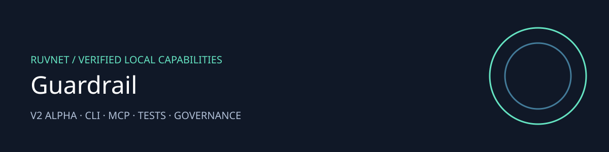

# Guardrail

Check structured data before an agent takes action.

Version 2 alpha provides a bounded local implementation with repeatable checks.

| Capability | What it does |
|---|---|
| Policy decisions | Missing fields deny; falsy present values remain valid |
| API protection | Bearer token, 64 KiB input, bounded provider calls |
| Agent interface | Local CLI and SDK 2 MCP tools and policy resource |
| Validation | Regression tests, local microbenchmark and dependency audit |

## Install and use

Requires Node 24 and Python 3.12 for Guardrail.

```sh
python -m venv .venv
.venv/bin/pip install -r requirements.txt
npm ci --prefix .harness/runtime
node .harness/runtime/cli.mjs status
RUV_ALLOW_VALIDATION=1 node .harness/runtime/cli.mjs test
RUV_ALLOW_VALIDATION=1 node .harness/runtime/cli.mjs benchmark
node .harness/runtime/cli.mjs mcp
```

[Agent tools and CLI](.harness/runtime/README.md) · [Architecture and security](docs/ADR-002-secure-local-agent.md) · [Generated MetaHarness profiles](.harness/generated/README.md)

## Scope and deployment

The local policy engine is deterministic validation, not a model safety guarantee. Provider routes require OPENAI_API_KEY and AUTH_TOKEN of at least 32 characters. Provider output remains untrusted data. No live paid provider test or production load qualification is claimed.

## Related projects

[RuFlo](https://github.com/ruvnet/ruflo) orchestrates agents. [MetaHarness](https://github.com/ruvnet/metaharness) provides repository harness profiles. [Autogenous](https://github.com/ruvnet/autogenous) supplies governance primitives. [RuVector](https://github.com/ruvnet/ruvector) supplies retrieval and memory. [AgentBBS](https://github.com/ruvnet/AgentBBS) and [the federation](https://x.ruv.io) support coordination. Federation observations are data and do not authorize execution. No federation membership or publication is enabled by this package.

Run the HTTP API with `AUTH_TOKEN=<32-or-more-characters> .venv/bin/uvicorn main:app --host 127.0.0.1 --port 8080`. Submit `POST /evaluate/` with a bearer token and `{ "details": { "approved": false }, "conditions": [{ "analysis_type": "local", "key": "approved", "condition_type": "exists" }] }`. This returns allowed because the field exists. Use an equality condition when its value matters.
